Good call — it’s cleaner to have **one Cloud Run service** that exposes several HTTP endpoints instead of two separate ones.
Below is a **revised Technical Design Document (TDD)** reflecting that unified-API design.

---

# 🧩 Technical Design Document

**System Name:** Gmail Push Processing API
**Author:** [Your Name / Team]
**Date:** 2025-10-14
**Version:** 1.1

---

## 📘 1  Purpose

Provide a single, fully-autonomous Cloud Run API that receives Gmail push notifications, processes new messages through custom Python logic, and automatically renews Gmail watch subscriptions — all without local machines or manual logins.

---

## ⚙️ 2  Architecture Overview

```mermaid
graph LR
A(Gmail Inbox) -->|New email| B(Gmail Push Watch)
B -->|Push| C(Pub/Sub Topic)
C -->|Push Subscription| D(Cloud Run API)
D -->|/email-notify| E(Gmail API)
E -->|→| F(Custom Logic)
G(Cloud Scheduler) -->|Every 6 days → /renew-watch| D
```



---

## 🧱 3  Key Components

| Component           | Technology               | Responsibility                                                                                                                                                   |
| ------------------- | ------------------------ | ---------------------------------------------------------------------------------------------------------------------------------------------------------------- |
| **Gmail API**       | Gmail Push Notifications | Detects new mail and notifies Pub/Sub.                                                                                                                           |
| **Pub/Sub Topic**   | Google Pub/Sub           | Transports Gmail events.                                                                                                                                         |
| **Cloud Run API**   | Flask / FastAPI          | Single service exposing endpoints:<br>• `/email-notify` – handle Pub/Sub pushes<br>• `/renew-watch` – renew Gmail watch<br>• (optional) `/health` – status check |
| **Cloud Scheduler** | Managed Cron             | Calls `/renew-watch` every 6 days.                                                                                                                               |
| **Service Account** | IAM                      | Authenticates Gmail API & Pub/Sub.                                                                                                                               |

---

## 🧭 4  Deployment Sequence

### Step 1  Authenticate & Select Project

```bash
gcloud auth login
gcloud config set project my-automation-project
gcloud config set run/region us-central1
gcloud services enable gmail.googleapis.com pubsub.googleapis.com run.googleapis.com cloudscheduler.googleapis.com
```

### Step 2  Create Pub/Sub Topic and Subscription

```bash
gcloud pubsub topics create gmail-incoming
gcloud pubsub subscriptions create gmail-incoming-sub --topic gmail-incoming
```

### Step 3  Create Service Account and Assign Roles

```bash
gcloud iam service-accounts create gmail-processor
gcloud projects add-iam-policy-binding $(gcloud config get-value project) \
  --member="serviceAccount:gmail-processor@$(gcloud config get-value project).iam.gserviceaccount.com" \
  --role="roles/pubsub.subscriber" \
  --role="roles/pubsub.publisher" \
  --role="roles/run.invoker" \
  --role="roles/gmail.readonly" \
  --role="roles/gmail.modify"
```

### Step 4  Allow Gmail to Publish to Pub/Sub

```bash
TOPIC="projects/$(gcloud config get-value project)/topics/gmail-incoming"
gcloud pubsub topics add-iam-policy-binding $TOPIC \
  --member="serviceAccount:gmail-api-push@system.gserviceaccount.com" \
  --role="roles/pubsub.publisher"
```

---

## 💻 5  Cloud Run API Application

### 5.1 Endpoints

| Endpoint        | Method | Trigger             | Description                                               |
| --------------- | ------ | ------------------- | --------------------------------------------------------- |
| `/email-notify` | `POST` | Pub/Sub push        | Handles Gmail notification; fetches & processes new mail. |
| `/renew-watch`  | `POST` | Cloud Scheduler     | Renews Gmail watch subscription.                          |
| `/health`       | `GET`  | Manual / Monitoring | Returns 200 OK for uptime checks.                         |

---

### 5.2 Request and Response Contracts

#### `/email-notify`

**Input (Pub/Sub push):**

```json
{
  "message": {
    "data": "eyJo...0fQ==",
    "messageId": "123456",
    "publishTime": "2025-10-14T12:00:00Z"
  }
}
```

**Decoded Data:**

```json
{ "historyId": "123456" }
```

**Output:**
`200 OK` (acknowledge Pub/Sub)

---

#### `/renew-watch`

**Input:** Empty body
**Output:**

```json
{
  "historyId": "123456",
  "expiration": 1700000000000
}
```

---

### 5.3 Core Functions and Responsibilities

| Function                           | Input                | Output     | Responsibility                                                       |
| ---------------------------------- | -------------------- | ---------- | -------------------------------------------------------------------- |
| `handle_email_notify(request)`     | Flask `Request`      | HTTP 200   | Decode Pub/Sub payload and extract `historyId`.                      |
| `process_history(history_id: str)` | Gmail history ID     | None       | Query Gmail `users.history.list` for new messages.                   |
| `fetch_message(message_id: str)`   | Gmail message ID     | `dict`     | Retrieve message metadata/body.                                      |
| `process_email(message: dict)`     | Gmail message object | None       | **Developer-defined logic** (parse, classify, store, call webhooks). |
| `renew_watch()`                    | None                 | JSON       | Issue Gmail `users.watch()` call with desired label filters.         |
| `get_gmail_service()`              | None                 | `Resource` | Build Gmail API client from service-account credentials.             |

---

### 5.4 Authentication

* Service-account credentials stored in **Secret Manager**.
* Loaded by both endpoint handlers using `google.oauth2.service_account`.
* No local tokens required.

---

### 5.5 Error Handling

| Condition        | Behavior                               |
| ---------------- | -------------------------------------- |
| Cloud Run error  | Pub/Sub retries (exponential backoff). |
| Invalid payload  | Return 200 OK + log error.             |
| Gmail rate limit | Retry with exponential delay.          |
| Expired watch    | Renewed automatically by Scheduler.    |

---

## 🕒 6  Cloud Scheduler Configuration

Trigger `/renew-watch` every 6 days:

```bash
gcloud scheduler jobs create http renew-gmail-watch \
  --schedule="0 0 */6 * *" \
  --uri="https://YOUR-CLOUD-RUN-URL/renew-watch" \
  --http-method=POST \
  --oidc-service-account-email=gmail-processor@$(gcloud config get-value project).iam.gserviceaccount.com
```

---

## ☁️ 7  Deployment

### Build & Deploy API

```bash
gcloud run deploy gmail-push-api \
  --source . \
  --service-account gmail-processor@$(gcloud config get-value project).iam.gserviceaccount.com \
  --allow-unauthenticated
```

### Link Pub/Sub to Endpoint

```bash
gcloud pubsub subscriptions update gmail-incoming-sub \
  --push-endpoint="https://YOUR-CLOUD-RUN-URL/email-notify" \
  --push-auth-service-account=gmail-processor@$(gcloud config get-value project).iam.gserviceaccount.com
```

---

## 🧠 8  Function Contract Summary

| Function Name           | Location        | Input        | Output     | Notes                          |
| ----------------------- | --------------- | ------------ | ---------- | ------------------------------ |
| `handle_email_notify()` | `/email-notify` | Pub/Sub JSON | 200 OK     | Entry point for notifications. |
| `process_history()`     | internal        | history ID   | None       | Finds new emails.              |
| `fetch_message()`       | internal        | message ID   | Gmail JSON | Gmail API fetch.               |
| `process_email()`       | internal        | message JSON | None       | **Developer custom logic.**    |
| `renew_watch()`         | `/renew-watch`  | None         | JSON       | Re-issues Gmail watch.         |
| `health()`              | `/health`       | None         | 200 OK     | Monitoring endpoint.           |

---

## 📁 9  Directory Structure

```
/gmail-pubsub
 ├── main.py
 ├── requirements.txt
 ├── Dockerfile
 ├── .dockerignore # includes infra/
 ├── app/
 │    ├── gmail_handler.py
 │    ├── process_email.py   # developer’s custom logic
 │    ├── watch_manager.py
 │    └── utils/
 │         └── logger.py
 ├── infra/
 │    ├── setup_pubsub.sh
 │    ├── setup_scheduler.sh
 └── README.md
```

---

## ⚡ 10  Non-Functional Requirements

| Area         | Target                                 |
| ------------ | -------------------------------------- |
| Latency      | < 5 s from email arrival to processing |
| Availability | ≥ 99.9 %                               |
| Scalability  | Auto-scaling via Cloud Run             |
| Security     | IAM-based auth; HTTPS only             |
| Maintenance  | Fully automated (no manual renewals)   |

---

## ✅ 11  Acceptance Checklist

* [ ] Gmail watch created and pushes to Pub/Sub.
* [ ] `/email-notify` receives Pub/Sub requests and invokes logic.
* [ ] `/renew-watch` successfully extends watch before expiration.
* [ ] Cloud Scheduler runs without manual intervention.
* [ ] Developer logic (`process_email`) executes correctly.
